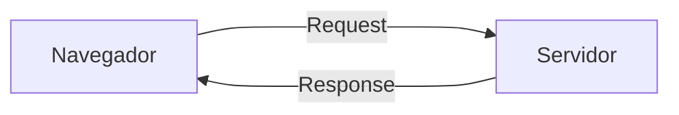
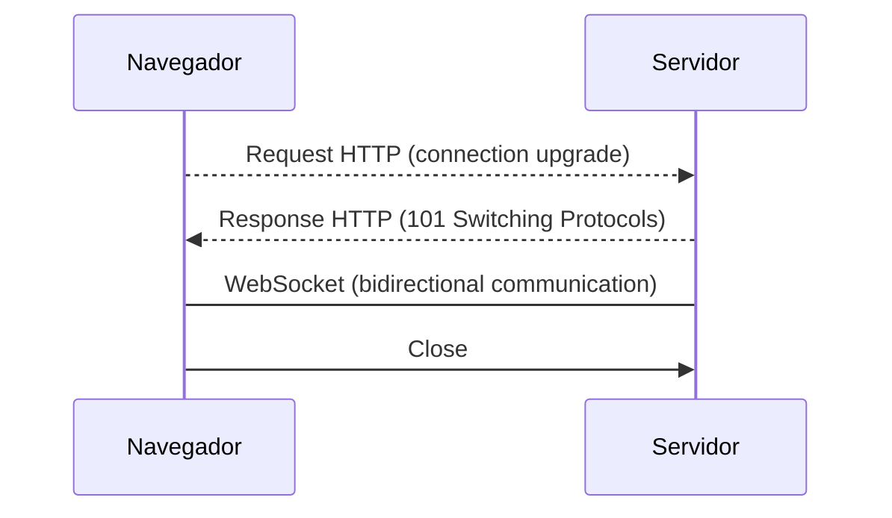
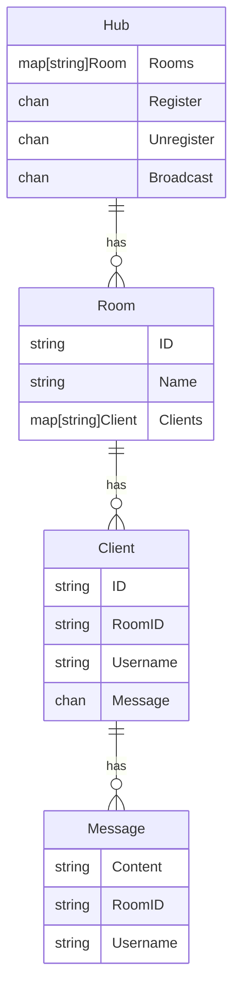

# Simple Chat Golang

---

<p align="center">&nbsp;&nbsp;&nbsp;&nbsp;</p>


### Esse é um projeto de backend!

> Motivação: Projeto pessoal para aprender sobre [Websockt](https://developer.mozilla.org/pt-BR/docs/Web/API/WebSockets_API) em [Go language](https://go.dev/).

Porém se você não sabe o que é um websocket, fique tranquilo, eu tenho aqui um guia de bolso que pode te ajudar!

---

## Guia De Bolso Para Websockt

Com base na definição [MDN](https://developer.mozilla.org/pt-BR/), a API WebSocket ([Websockt](https://developer.mozilla.org/pt-BR/docs/Web/API/WebSockets_API)) é uma tecnologia avançada que torna possível abrir uma sessão de comunicação bidirecional entre o navegador do usuário e um servidor. Mas o que isso significa exatamente e como funciona na vida real?

Vamos começar do início... Vamos tentar acessar seu site favorito (uma sugestão: [papertoilet.com](https://papertoilet.com/))

O navegador envia uma solicitação ao servidor. O servidor então verifica se a página solicitada existe e envia a resposta de volta ao navegador. Se a página existir, o servidor a envia de volta. Se não existir, o servidor retorna um erro.


Para fazer essa comunicação eles usam o protocolo conhecido como [HTTP](https://developer.mozilla.org/pt-BR/docs/Web/HTTP). O princípio principal do HTTP é que, para obter informações da página da web, o navegador primeiro precisa perguntar ao servidor se essa informação existe. O servidor então verifica e envia uma resposta. 

##### Problema:
Por exemplo, para obter uma atualização em um chat, você teria que atualizar constantemente a página do chat.
> É como ter uma criança no banco de trás perguntando “Já chegamos”

##### Solução:

Felizmente, os desenvolvedores resolveram isso com o WebSocket!
WebSockets é uma das formas mais antigas de comunicação bidirecional e é amplamente utilizado atualmente. É compatível com a maioria dos navegadores e é relativamente fácil de usar.

### Como o Websocket funciona?


WebSockets usa HTTP para enviar uma solicitação inicial ao servidor. Esta é uma solicitação HTTP normal, mas contém um cabeçalho HTTP espe  cial `Connection: Upgrade`. Isso informa ao servidor que o cliente está tentando atualizar a conexão TCP das solicitações HTTP para um WebSocket de longa execução. Se o servidor responder com um `HTTP 101 Switching Protocols` então a conexão será mantida ativa, possibilitando que o Cliente e o Servidor enviem mensagens bidirecionais.

Esse é foi nosso "Guia De Bolso Para Websockt"! Se você quiser entender mais sobre o que está acontecendo durante a configuração, posso recomendar o [RFC 6455](https://datatracker.ietf.org/doc/html/rfc6455).

---

## Base da Aplicação

Vamos usar algumas dependências para agilizar as coisas:

- [Gin Web Framework](https://gin-gonic.com/) (v1.9.1)
- [Gorilla WebSocket](https://github.com/gorilla/websocket) (v1.5.1)

Para saber mais acesse a documentação.


## Estrutura do projeto

```sh
/simple-chat-golang
│   go.mod
│   go.sum
│   README.md
│   
├───/cmd
│       main.go
│       
├───/internal
│   └───/ws
│           client.go
│           hub.go
│           ws_handler.go
│
└───/router
        router.go
```

- `main.go` Onde inicializamos as Instâncias da aplicação.
- `router.go` Onde definimos as rotas da aplicação.
- `ws_handler.go` Aqui está fazendo o papel do `controller`
- `client.go` Cordena a leitura e envio de mensagens para cada `client`
- `hub.go` Cordena o registro e cancelamento de novas `rooms`, `clients` e o envio em massage de mensagens por `room`


## Diagramas de relacionamento entre entidades



## Endpoints

O endpoint abaixo serve para criar uma nova "room". (Na verdade apenas alocamos um espaço de memória para armazená-lo)

<details>
 <summary><code>POST</code> <code><b>/ws/create_room</b></code> <code>(Acessado por HTTP normal)</code></summary>

##### Parameters

> | name      |  type     | data type               |
> |-----------|-----------|-------------------------|
> | id        |  required | string (JSON)           | 
> | name      |  required | string (JSON)           | 


##### Responses

> | http code     | content-type                      | response                                  |
> |---------------|-----------------------------------|-------------------------------------------|
> | `200`         | `application/json; charset=utf-8` | `{"id": "uuid", "name": "Something" }`    |

##### Example cURL

> ```sh
>  curl -X POST -H "Content-Type: application/json" --data '{"id": "uuid", "name": "Something" }' http://localhost:8080/ws/create_room
> ```
</details>

---

O endpoint abaixo serve para listar as "rooms" criadas.

<details>
 <summary><code>GET</code> <code><b>/ws/rooms</b></code> <code>(Acessado por HTTP normal)</code></summary>

##### Responses

> | http code     | content-type                      | response                                  |
> |---------------|-----------------------------------|-------------------------------------------|
> | `200`         | `application/json; charset=utf-8` | `{ "rooms": [ ... ] }`    |

##### Example cURL

> ```sh
>  curl -X GET  http://localhost:8080/ws/rooms
> ```
</details>

---

O endpoint abaixo serve para estabelecer uma conexão websocket (recomendo usar [`new WebSocket(url)`](https://developer.mozilla.org/en-US/docs/Web/API/WebSocket) do javascript)

<details>
 <summary><code>GET</code> <code><b>/ws/join_room/:id_room?user_id=:user_id&username=:username</b></code> <code>(Acessado apenas usando o WebSocket)</code></summary>

##### URL - Parameters

> | name      |  type     | data type               |
> |-----------|-----------|-------------------------|
> | id_room   |  required | string (URL Params)     | 
> | user_id   |  required | string (URL Params)     |
> | username  |  required | string (URL Params)     | 

##### Responses

> | http code     | content-type                      | response                                  |
> |---------------|-----------------------------------|-------------------------------------------|
> | `200`         | `application/json; charset=utf-8` | `{ "rooms": [ ... ] }`    |

##### Example Javascript

Depois de ter criado as "rooms", abra duas aba do seu navegador, digite o código abaixo e seja a mágica acontecer! (não esqueça de trocar as variáveis)

> ```javascript
> let ws = new WebSocket("ws://localhost:8080/ws/join_room/uuid?user_id=xpto&username=john_doe")
> ws.onmessage = value => { console.log(value) }
> ws.send("Hello world!")
> ```
</details>

---

O endpoint abaixo serve para listar os "clients" da sala com base no `room_id`.

<details>
 <summary><code>GET</code> <code><b>/ws/rooms/:id_room/clients</b></code> <code>(Acessado por HTTP normal)</code></summary>

##### Responses

> | http code     | content-type                      | response                                  |
> |---------------|-----------------------------------|-------------------------------------------|
> | `200`         | `application/json; charset=utf-8` | `{ "clients": [ ... ] }`    |

##### Example cURL

> ```sh
>  curl -X GET  http://localhost:8080/ws/rooms/:id_room/clients
> ```
</details>

---

## Rodar o projeto 

Instale o [Go language](https://go.dev/), faça o `git clone` e execute o seguinte comando no terminal dentro da pasta.

```sh
go mod tidy
go run .\cmd\main.go
```

---

## License

Copyright 2023 Wellington Dos Santos

Permission is hereby granted, free of charge, to any person obtaining a copy of this software and associated documentation files (the “Software”), to deal in the Software without restriction, including without limitation the rights to use, copy, modify, merge, publish, distribute, sublicense, and/or sell copies of the Software, and to permit persons to whom the Software is furnished to do so, subject to the following conditions:

The above copyright notice and this permission notice shall be included in all copies or substantial portions of the Software.

THE SOFTWARE IS PROVIDED “AS IS”, WITHOUT WARRANTY OF ANY KIND, EXPRESS OR IMPLIED, INCLUDING BUT NOT LIMITED TO THE WARRANTIES OF MERCHANTABILITY, FITNESS FOR A PARTICULAR PURPOSE AND NONINFRINGEMENT. IN NO EVENT SHALL THE AUTHORS OR COPYRIGHT HOLDERS BE LIABLE FOR ANY CLAIM, DAMAGES OR OTHER LIABILITY, WHETHER IN AN ACTION OF CONTRACT, TORT OR OTHERWISE, ARISING FROM, OUT OF OR IN CONNECTION WITH THE SOFTWARE OR THE USE OR OTHER DEALINGS IN THE SOFTWARE.